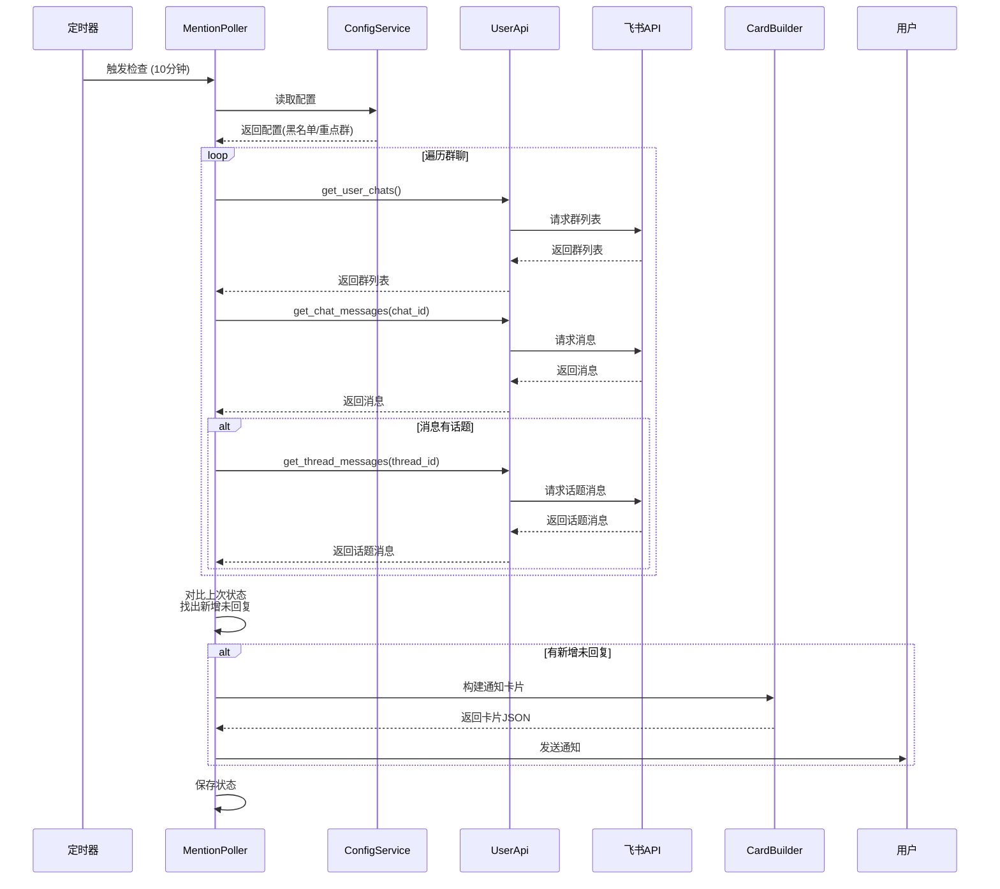
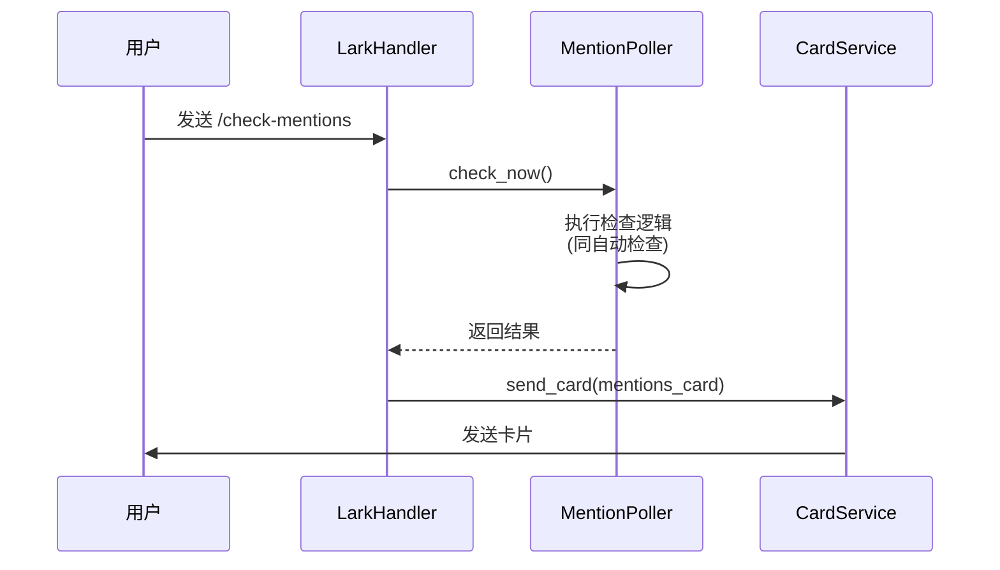

# Remote Claude - @消息检测功能架构图

## 整体架构

```mermaid
graph TB
    subgraph "飞书端"
        User[用户] -->|发送命令/点击按钮| LarkBot[飞书机器人]
        LarkBot -->|推送消息| User
    end

    subgraph "Remote Claude - lark_client/"
        LarkBot <-->|长连接| Main[main.py<br/>守护进程]

        Main --> LarkHandler[lark_handler.py<br/>命令路由]
        Main --> SharedMemPoller[shared_memory_poller.py<br/>卡片轮询]
        Main --> TextPoller[text_message_poller.py<br/>文本轮询]
        Main --> MentionPoller[mention_poller.py<br/>@消息轮询<br/>⭐新增]

        LarkHandler --> SessionBridge[session_bridge.py<br/>会话桥接]
        LarkHandler --> CardService[card_service.py<br/>卡片服务]
        LarkHandler --> ConfigService[config_service.py<br/>统一配置<br/>⭐新增]

        MentionPoller --> UserApi[user_api.py<br/>用户API]
        MentionPoller --> ConfigService
        MentionPoller --> CardService

        UserApi --> OAuthService[oauth_service.py<br/>OAuth服务]
        OAuthService --> OAuthServer[oauth_server.py<br/>OAuth回调]

        CardService --> CardBuilder[card_builder.py<br/>卡片构建]
    end

    subgraph "存储"
        ConfigService -.->|读写| ConfigFile[(~/.remote-claude/<br/>config.json)]
        OAuthService -.->|读写| TokenFile[(~/.remote-claude/<br/>user_tokens.json)]
        MentionPoller -.->|读写| StateFile[(~/.remote-claude/<br/>mention_state.json)]
    end

    subgraph "飞书 API"
        UserApi -->|HTTP| FeishuAPI[飞书开放平台 API]
        OAuthServer <-->|OAuth 2.0| FeishuAPI
    end

    subgraph "Claude Server"
        SessionBridge <-->|Unix Socket| Server[server/server.py]
        SharedMemPoller -.->|读取| SharedMem[(.mq 共享内存)]
        Server -.->|写入| SharedMem
    end

    style MentionPoller fill:#90EE90
    style ConfigService fill:#90EE90
    style CardBuilder fill:#FFE4B5
    style CardService fill:#FFE4B5
    style LarkHandler fill:#FFE4B5
```

## 核心模块职责

### 新增模块

#### 1. mention_poller.py - @消息轮询器
```python
class MentionPoller:
    """@消息自动检查轮询器"""
    - 定时检查未回复@消息
    - 支持手动触发检查
    - 新增消息通知
    - 状态持久化

class MentionState:
    """@消息状态跟踪"""
    - 上次检查时间
    - 已知未回复消息列表
    - 用于判断"新增"
```

#### 2. config_service.py - 统一配置服务
```python
class ConfigService:
    """统一配置管理"""
    - 加载/保存配置
    - 配置验证
    - 默认值管理

    配置项：
    - mention_auto_check: bool
    - mention_interval: int (分钟)
    - mention_blacklist: List[str]
    - mention_priority: List[str]
    - notify_on_complete: bool (群聊完成提醒)
    - ... 其他配置
```

### 修改模块

#### 3. lark_handler.py - 命令路由
新增命令：
- `/check-mentions` - 手动检查@消息
- `/mentions-auto on|off [interval]` - 开启/关闭自动检查
- `/mentions-config` - 配置黑名单/重点群
- `/mentions-status` - 查看@消息检查状态
- `/commands` - 命令总览（替代 /help）
- `/config` - 统一配置入口

优化命令：
- OAuth 相关命令整合

#### 4. card_builder.py - 卡片构建
新增卡片：
- `build_mentions_card()` - @消息列表卡片（带群聊链接）
- `build_commands_card()` - 命令总览卡片
- `build_config_card()` - 配置管理卡片

优化：
- 统一卡片样式
- 统一按钮交互

### 保持不变

- `shared_memory_poller.py` - 卡片模式轮询（不变）
- `text_message_poller.py` - 文本模式轮询（不变）
- `session_bridge.py` - 会话桥接（不变）
- `user_api.py` - 用户 API（不变）
- `oauth_service.py` - OAuth 服务（不变）

## 数据流

### 自动检查流程



### 手动检查流程



## 配置文件结构

### ~/.remote-claude/config.json

```json
{
  "version": "1.0",
  "mention": {
    "auto_check_enabled": true,
    "check_interval_minutes": 10,
    "blacklist_chats": ["oc_xxx1", "oc_xxx2"],
    "priority_chats": ["oc_xxx3"],
    "notify_priority_only": false
  },
  "notification": {
    "on_complete": true,
    "on_error": true,
    "urgent_at_mention": true
  },
  "ui": {
    "message_mode": "text",
    "bypass_permission": false
  }
}
```

### ~/.remote-claude/mention_state.json

```json
{
  "last_check_time": 1234567890,
  "known_unreplied": {
    "om_xxx1": {
      "chat_id": "oc_yyy1",
      "chat_name": "群名称",
      "time": 1234567890,
      "sender": "ou_zzz1",
      "location": "话题回复"
    }
  }
}
```

## 菜单配置

### 飞书机器人底部菜单

```
┌─────────────┬─────────────┬─────────────┐
│ 会话列表     │ 检查@消息    │ 命令总览     │
│ /list       │ /check      │ /commands   │
│             │ -mentions   │             │
└─────────────┴─────────────┴─────────────┘
```

优化说明：
- 从 5 个减少到 3 个（飞书推荐 2-4 个）
- 移除"创建群组"（低频，放到命令总览）
- 移除"当前状态"（低频，放到命令总览）
- 移除"帮助"（由"命令总览"替代）
